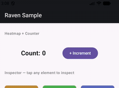
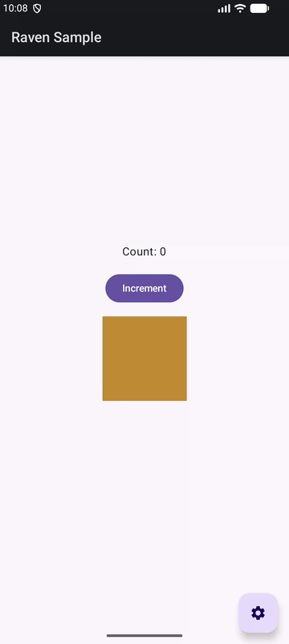
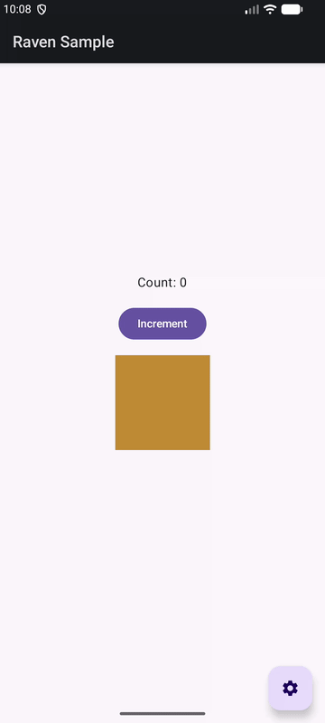

# compose-raven

A zero-boilerplate in-app debug overlay for Jetpack Compose. Drop it in as a dependency and a floating toolbar appears in your debug build — no setup code required.

```kotlin
implementation("io.github.dracovin:compose-raven:0.1.0-alpha01")
```

---

## Features

### Recomposition Heatmap

Flashes an orange highlight on any composable every time it recomposes. Add `Modifier.recompositionHeatmap()` to spot unnecessary recompositions instantly.



### Element Inspector

Tap any element tagged with `Modifier.ravenInspectable("tag")` to see its color, position, tag, and size in a card at the bottom of the screen.



### Grid Overlay

Draws an 8dp grid with Material Design keylines (16dp cyan, 24dp orange) over the entire screen to verify spacing and alignment.



---

## Installation

Add to your app's `build.gradle.kts`:

```kotlin
dependencies {
    debugImplementation("io.github.dracovin:compose-raven:0.1.0-alpha01")
}
```

> Using `debugImplementation` keeps the overlay out of your release builds.

Make sure `mavenCentral()` is in your `settings.gradle.kts`:

```kotlin
dependencyResolutionManagement {
    repositories {
        google()
        mavenCentral()
    }
}
```

That's it. No `Application` subclass, no manifest changes, no init code.

---

## Usage

### Recomposition Heatmap

```kotlin
Text(
    text = "Count: $counter",
    modifier = Modifier.recompositionHeatmap()
)
```

### Element Inspector

```kotlin
Box(
    modifier = Modifier
        .size(120.dp)
        .background(Color(0xFFc18a35))
        .ravenInspectable("amber-box")
)
```

The `tag` is optional but helps identify elements in the inspector card.

### Enabling Features

A draggable **⚙️ FAB** appears in the bottom-right corner of every screen. Tap it to expand toggle chips for each feature. Drag it anywhere if it overlaps your UI.

---

## Requirements

| | |
|---|---|
| Min SDK | 26 |
| Compile SDK | 35 |
| Kotlin | 2.0+ |
| Jetpack Compose | BOM 2024.09.00+ |

---

## License

[Apache License 2.0](LICENSE)
