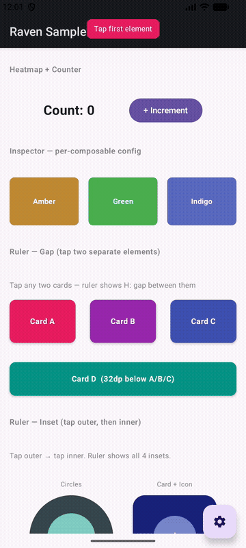

# compose-raven

[](https://central.sonatype.com/artifact/io.github.dracovin/compose-raven)
[](LICENSE)
[](https://android-arsenal.com/api?level=26)

**On-device debug tools for Jetpack Compose. No USB cable. No Android Studio. No setup code.**

Drop it in as a `debugImplementation` dependency and a floating toolbar appears in your debug builds automatically — powered by `androidx.startup`. Tap elements, measure spacing, catch recompositions, and verify grid alignment, all on a real device.

```kotlin
debugImplementation("io.github.dracovin:compose-raven:0.1.0-alpha02")
```

---

## Features

### Recomposition Heatmap


Add `Modifier.recompositionHeatmap()` to any composable and watch it flash on every recomposition. A badge in the corner tracks the count and changes color — green → yellow → red — so heavy recomposers stand out instantly.

```kotlin
Text(
    text = "Count: $counter",
    modifier = Modifier.recompositionHeatmap(showCount = true)
)
```

<br clear="right"/>

---

### Element Inspector


Tag composables with `Modifier.ravenInspectable()`, then tap them in the overlay to instantly see:

- **Color** — sampled directly from the screen pixel
- **Size** — exact dp dimensions
- **Position** — coordinates on screen
- **Tag & group** — your own labels

**Double-tap** to pin the card so it stays while you scroll or interact. Elements that share a `group` all highlight together — great for nav tabs, chip rows, or any repeated pattern.

```kotlin
Box(
    modifier = Modifier
        .size(120.dp)
        .background(Color(0xFF6200EE))
        .ravenInspectable(
            tag = "hero-card",
            group = "cards",
            config = InspectorConfig(highlightColor = Color.Cyan)
        )
)
```

<br clear="right"/>

---

### Ruler



Measure the distance between any two elements without opening Layout Inspector.

- **Tap element 1** → highlighted in pink
- **Tap element 2** → gap or inset lines drawn with dp labels

**Gap mode** — elements are separate: shows horizontal and/or vertical distance with tick marks.

**Inset mode** — elements overlap or nest: auto-detects inner/outer and shows all four insets (left, right, top, bottom).

A hint chip at the top guides you through each step. Tap again to reset and start a new measurement.

<br clear="right"/>

---

### Grid Overlay


Draws an 8dp grid with Material Design keylines over the entire screen. Instantly catch misaligned spacing without measuring manually.

| Color | Keyline |
|-------|---------|
| Cyan | 16dp |
| Orange | 24dp |

```kotlin
ComposeRaven.setGridConfig(
    GridConfig(
        gridSpacing = 8.dp,
        showKeylines = true
    )
)
```

<br clear="right"/>

---

## Installation

Add to your app's `build.gradle.kts`:

```kotlin
dependencies {
    debugImplementation("io.github.dracovin:compose-raven:0.1.0-alpha02")
}
```

> `debugImplementation` keeps the overlay out of release builds automatically.

Make sure `mavenCentral()` is in your `settings.gradle.kts`:

```kotlin
dependencyResolutionManagement {
    repositories {
        google()
        mavenCentral()
    }
}
```

**That's it.** No `Application` subclass. No manifest changes. No init code.

A draggable **FAB** appears in the bottom-right corner. Tap it to expand toggle chips for each tool. Drag it anywhere if it overlaps your UI.

---

## Requirements

| | |
|---|---|
| Min SDK | 26 |
| Compile SDK | 35 |
| Kotlin | 2.0+ |
| Jetpack Compose | BOM 2024.09.00+ |

---

## License

[Apache License 2.0](LICENSE)

---

<!-- keywords: jetpack compose debug overlay, compose recomposition heatmap, compose recomposition tracker, android compose ui inspector, jetpack compose layout inspector, compose element picker, android 8dp grid overlay, compose ruler spacing tool, compose debug tools, jetpack compose performance debugging -->